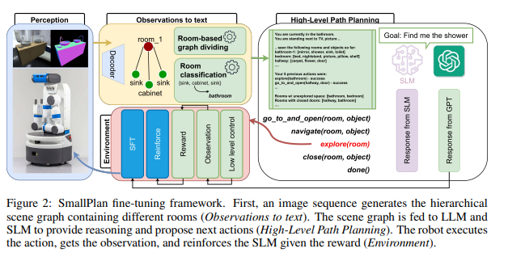

# SmallPlan: Leverage Small Language Models for Sequential Path Planning with Simulation-Powered, LLM-Guided Distillation

Updating...

<p align="center">
  <!--  -->
  
</p>

## Code overview

SmallPlan adopts the open-sourced code from MoMaLLM [[**paper**](https://arxiv.org/abs/2403.08605)] and TextGames [[**paper**](https://arxiv.org/abs/2502.18431)]

* We use MoMaLLM code base for simulation and LLM agent set-up. We then add functions for fine-tuning the SLMs with SFT and RL. The training and reward functions are provided in ```./src/train_from_simulation/packages/moma_llm/env/llm_env.py```

* We use TextGames for Out-of-domain Analysis experiment. In their code base, we mostly run ```./textgames/agents/dsr1_distill.py``` to test our fine-tuned SLMs. 

The weight of the fine-tunned SLMs can be found [**here**](https://mbzuaiac-my.sharepoint.com/:f:/g/personal/cuong_pham_mbzuai_ac_ae/EuZoi_N-OvtEsRHnlMObw0UB0WmpykeMQTjKOxMcMKbFjw?e=1blu1h)

Our code requires 2 different python venv to run. This is due to the module conflicts of igibson environment versus the unsloth environment for training. We use the ```smallplan``` environment to set up the SLMTrainer and expose it externally through FastAPI. The ```igibson``` environment is then used to run the simulation, which communicates with the SLMTrainer by making API calls for each training epoch. 

Alternatively, the SLMTrainer API could be hosted in a Docker container. However, we don't do this because our server is already Docker-based, and it does not permit creating child containers within the main container.

## Local installation

### iGibson prerequisite

1. Install iGibson: https://stanfordvl.github.io/iGibson/installation.html
2. Update the conda environment for igibson with the dependencies with `pip3 install -r requirements.txt --extra-index-url https://download.pytorch.org/whl/cu113`

### Python venv setup

For ```smallplan``` environment (Python 3.11), ```pip install -r requirements.api.txt``` is all you need.

For ```igibson``` environment (Python 3.8), ```pip install -r requirements.txt``` is all you need.

Please run ```cp .env.example .env``` in the terminal and add your ```WANDB_API_KEY, OPENAI_ORGANIZATION, OPENAI_API_KEY```

### Training

First, please go to ```./configs/slm_training.yaml``` and ```./configs/wandb.yaml``` and chaneg your config.

Open a terminal and run

```bash
conda activate smallplan
(smallplan) python -m src.slm_api.app
```

Open another terminal and run
```bash
conda activate igibson
(igibson) python -m src.train_from_simulation.app
```
## Citation

Please cite our work if you find helpful.

```
@misc{pham2025smallplanleveragesmalllanguage,
      title={SmallPlan: Leverage Small Language Models for Sequential Path Planning with Simulation-Powered, LLM-Guided Distillation}, 
      author={Quang P. M. Pham and Khoi T. N. Nguyen and Nhi H. Doan and Cuong A. Pham and Kentaro Inui and Dezhen Song},
      year={2025},
      eprint={2505.00831},
      archivePrefix={arXiv},
      primaryClass={cs.RO},
      url={https://arxiv.org/abs/2505.00831}, 
}
```